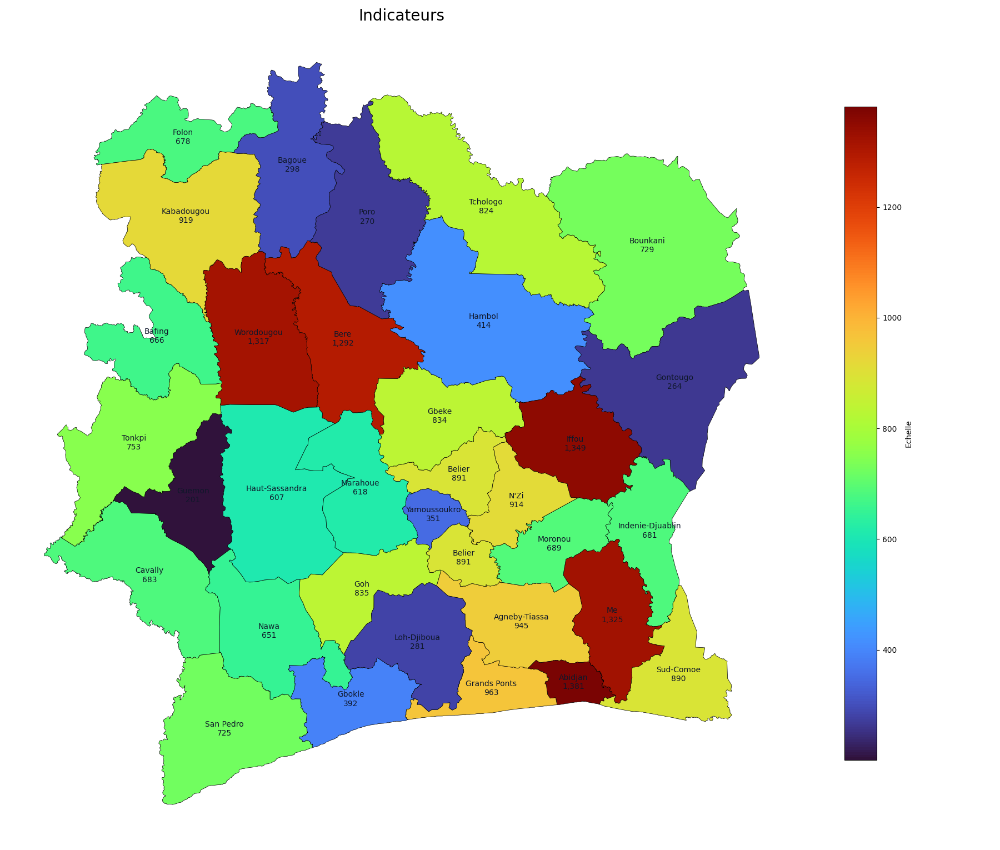

🥳 UPDATE DE L'UI ET DE L'API EN BACKEND


# 📄 Présentation



## Description du projet

Cette application offre une visualisation cartographique dynamique des données par région de la cote d'ivoire. Construite avec Nextjs et Python, elle permet aux utilisateurs d'importer des données et de les visualiser géographiquement.

## Fonctionnalités principales

- Importer des fichiers CSV contenant les données.
- Tableau de bord interactif affichant des indicateurs clés.
- Visualisation cartographique de la répartition des apprenants par région.
- Palettes de couleurs personnalisables pour les visualisations.

## Technologies utilisées

- **Frontend** : [Next.js](https://nextjs.org) pour le développement de l'interface utilisateur.
- **Backend** : [FastAPI](https://fastapi.tiangolo.com/) pour la gestion des API et des données.

# ⚙️ Configuration et installation de base

Commencez par cloner le dépot via la commande suivante :

   ```bash
   git clone https://github.com/Mr-KAM/carte-dynamique.git
   cd carte-dynamique
   ```

## Structure du projet (arborescence)

```bash
carte-dynamique:.
+---backend                     # Dossier du backend
ª   +---map with streamlit      # Dossier de l'application de carte dynamique avec streamlit
ª   ª   +---.streamlit          # Dossier de configuration de streamlit
ª   ª   +---data                # Dossier de données
ª   ª   ª   +---csv             # Dossier de données au format csv
ª   ª   ª   +---shp             # Dossier de données au format shp
ª   ª   +---modules
ª   +---maps                    # Dossier de l'api en backend avec fastapi
ª       +---data                # Dossier de données
ª       ª   +---csv
ª       ª   +---shp
+---frontend                    # Dossier du frontend
ª   +---app                     # Dossier de l'application
ª   ª   +---about
ª   ª   +---dashboard
ª   ª   +---importer
ª   ª   +---ivoireai
ª   ª   +---map
ª   +---components              # Dossier des composantes
ª   ª   +---heroSection
ª   ª   +---mapsViz
ª   ª   +---navbar
ª   ª   +---plateformeContent
ª   ª   +---ui
ª   ª   +---UploadFile
ª   +---hooks
ª   +---lib
ª   +---public
ª   +---store
ª   +---utils
+---img                         # Dossier d'images pour le fichier Readme.md
```

## 📊 FrontEnd

Le font est un projet [Next.js](https://nextjs.org) créé via [`create-next-app`](https://nextjs.org/docs/app/api-reference/cli/create-next-app).

### Configuration

Tout d'abord accdez au dossier fontend puis lancez le serveur de développement :

```bash
# Accédez au dossier frontend
cd frontend
# Installez les dépendances
npm install
# Lancez ensuite le serveur de développement du frontend
npm run dev
# ou yarn dev ou pnpm dev ou bun dev

```

**NB:** Assurez vous d'avoir Node.js installé sur votre machine et npm également. Vous pouvez le télécharger [ici](https://nodejs.org/).

### Utilisation
Ouvrez [http://localhost:3000](http://localhost:3000) dans votre navigateur pour voir le résultat.

Vous pouvez éditer le font du projet en modifiant les fichiers présent dans  `./frontend/app/`. Les pages se met automatiquement à jour lorsque vous modifiez un fichier.

Ce projet utilise [`next/font`](https://nextjs.org/docs/app/building-your-application/optimizing/fonts) pour optimiser automatiquement et charger la police [Geist](https://vercel.com/font), une nouvelle famille de polices proposée par Vercel.

### Documentation Next.js au bésoin

Pour en savoir plus sur Next.js, consultez les ressources suivantes :

- [Documentation de Next.js](https://nextjs.org/docs) - découvrez les fonctionnalités et l’API de Next.js.
- [Apprendre Next.js](https://nextjs.org/learn) - un tutoriel interactif sur Next.js.

Vous pouvez également consulter [le dépôt GitHub de Next.js](https://github.com/vercel/next.js) - vos retours et contributions sont les bienvenus !

### Process de déployement sur Vercel

La manière la plus simple de déployer l'application Next.js est d’utiliser la [plateforme Vercel](https://vercel.com/new?utm_medium=default-template&filter=next.js&utm_source=create-next-app&utm_campaign=create-next-app-readme), proposée par les créateurs de Next.js.

Consultez la [documentation sur le déploiement Next.js](https://nextjs.org/docs/app/building-your-application/deploying) pour plus de détails.


## 🗝️ BackEnd

Le backend est un projet [FastAPI](https://fastapi.tiangolo.com/) qui gère les API et les données.
### Configuration

Accédez au dossier backend puis lancez le serveur de développement :

```bash
# Accédez au dossier backend
cd backend/map
```

Pour eviter les dépendances conflictuelles, il est recommandé d'utiliser un environnement virtuel. Voici comment procéder :

```bash
# Installation de pew (si pas déjà installé)
# pew est un outil de gestion d'environnement virtuel pour Python
pip install pew
# Création d'un environnement virtuel
pew new carto-env
# Activation de l'environnement virtuel
pew workon carto-env

# Installation des dépendances
pip install -r requirements.txt
```

### Lancer le serveur d'API

Pour lancer le serveur d'API, assurez vous d'avoir accédé au dossier `maps` et utilisez la commande suivante :

```bash
# Lancement du serveur d'API
uvicorn app:app --reload
```

Le serveur d'API sera accessible à l'adresse [http://localhost:8000](http://localhost:8000).

### Utilisation de l'API
Pour accéder à la documentation automatique de ton API :

- **Swagger UI :** http://localhost:8000/docs

- **Redoc :** http://localhost:8000/redoc


# ➕ Amélioration et fonctionnalité a vénir

A définir
