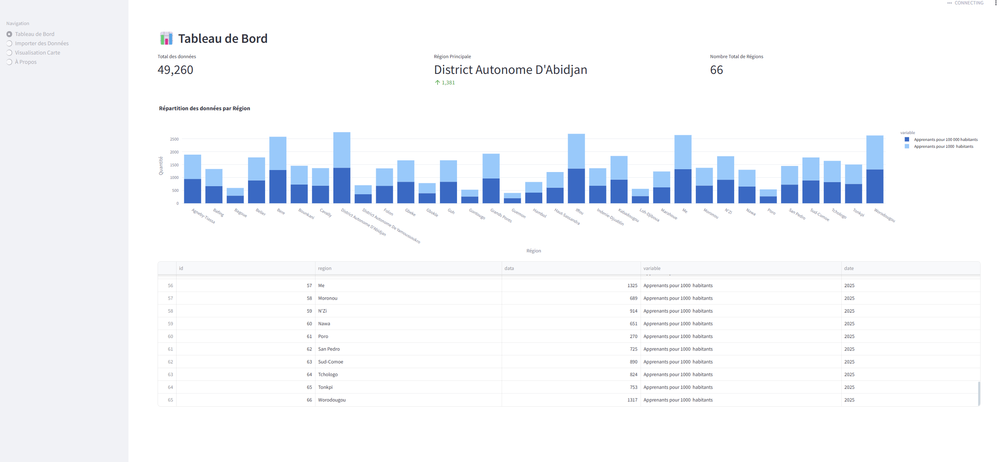

# Application de Carte Dynamique


## Description
Cette application offre une visualisation cartographique dynamique des données par région de la cote d'ivoire. Construite avec Streamlit et Python, elle permet aux utilisateurs d'importer des données et de les visualiser géographiquement.

## Fonctionnalités
- Importer des fichiers CSV contenant les données.
- Tableau de bord interactif affichant des indicateurs clés.
- Visualisation cartographique de la répartition des apprenants par région.
- Palettes de couleurs personnalisables pour les visualisations.



## Installation

Pour eviter les dépendances conflictuelles, il est recommandé d'utiliser un environnement virtuel. Voici comment procéder :

```bash
pip install pew
pew new carto-env
pew workon carto-env
```

Cette etape de creation d'un environnement virtuel n'est pas obligatoire, mais elle peut faciliter la gestion des dépendances.

Vous pouvez après celà cloner le dépôt et installer les dépendances requises.


1. Cloner le dépôt :

[https://github.com/Mr-KAM/carte-dynamique.git](https://github.com/Mr-KAM/carte-dynamique.git)
   ```bash
   git clone https://github.com/Mr-KAM/carte-dynamique.git
   cd carte-dynamique
   ```
2. Installer les paquets requis :
   ```bash
   pip install -r requirements.txt
   ```

## Utilisation
1. Exécuter l'application :
   ```bash
   streamlit run main.py
   ```
2. Ouvrez votre navigateur web et rendez-vous sur `http://localhost:8501` pour accéder à l'application.

3. Utilisez la barre latérale pour naviguer entre le tableau de bord, l'importation des données et les sections de visualisation cartographique.

## Contribuer
Les contributions sont les bienvenues ! Veuillez soumettre une demande de tirage ou ouvrir un problème pour toute suggestion ou amélioration.

## Licence
Ce projet est sous licence MIT.
